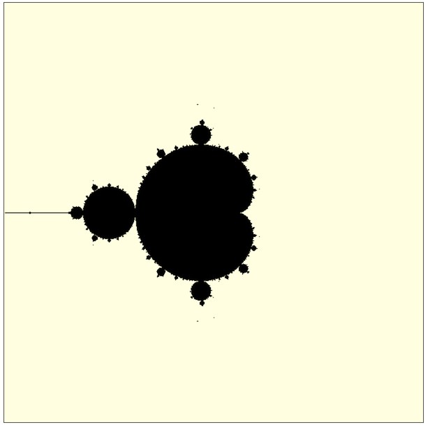
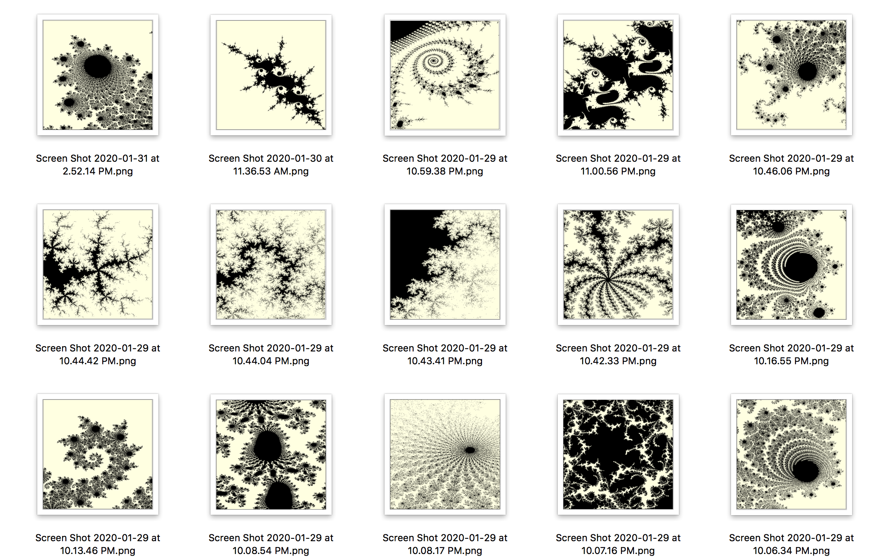

# Mandelbrot Set Explorer

You can view and explorer the [Mandelbrot Set](https://en.wikipedia.org/wiki/Mandelbrot_set) with this browser-based app.

# Install and Usage

Prerequist: Node.js.

First clone or download this repository as a zip file into a directory,
and cd into it. Then:

`npm install`

Then:

`npm start`

This will start the application at `http://localhost:8080` <- navigate
to this URL in your browser, and you shall see:

.

Once you are here, you can zoom in by clicking and then dragging
within the plot to form a rectangle.

## Some Scenes to Find

.

## Videos

* You may [watch me explain the Mandelbrot Set and walk through the code](https://www.youtube.com/watch?v=9cZovkFQmf4)
* Find more [videos on YouTube about the Mandelbrot Set](https://www.youtube.com/results?search_query=mandelbrot+set).
